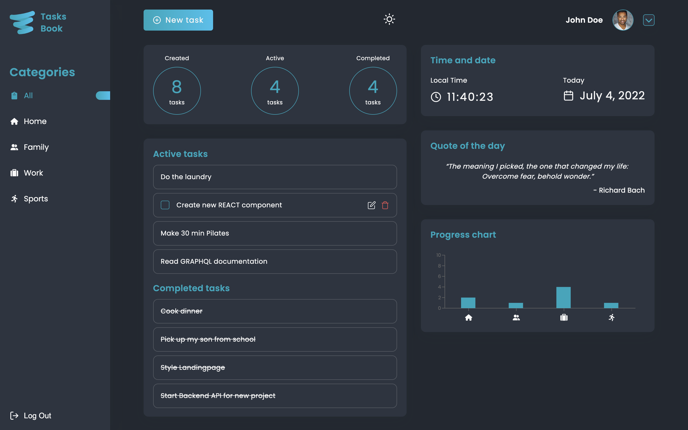

# Tasks Book

## Overview

A web-based task management application designed to help users organize and prioritize their daily tasks efficiently

## Features:

- Create and custimize a userprofile.
- Mark task as completed / uncompleted.
- Edit task.
- Delete task.
- Divide your tasks by categories.
- Light / Dark modus layout.
- Full responsiveness, (available in all screen devices).

## Tools && Technologies:

- [React](https://reactjs.org/)
- [Fela && React-Fela](https://fela.js.org/)
- [Recharts](https://recharts.org/en-US/)
- [Quotable (Quotations API) Copyright © 2019 Luke Peavey](https://github.com/lukePeavey/quotable?tab=readme-ov-file)
- [FontAwesome](https://fontawesome.com/)
- [Apollo-Client](https://www.apollographql.com/docs/react/)

## View this proyect 👇

- To the [tasks-book ](https://tasks-book-nine.vercel.app/)

Design by [CupTeam](http://cupteam.com.ua/)
&&
[Darsh Bhavsar](https://www.figma.com/community/file/1075400112363458636)

Devoloped by [Habid Badillo](https://habid-badillo.vercel.app/)
